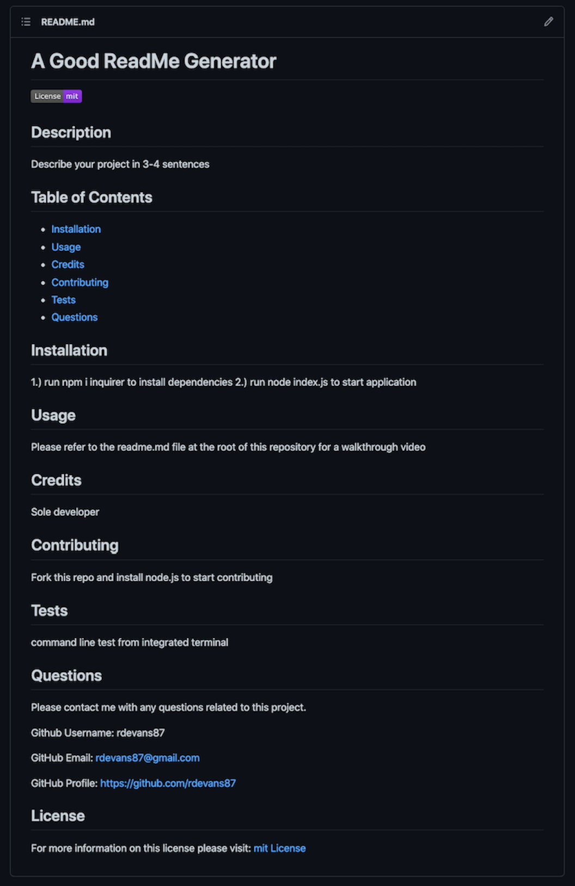

# ReadMeGenerator_NodeJs


## Description

09 Node.js Homework: Professional README Generator

This is a command-line application that dynamically generates a professional README.md file from a user's input using the [Inquirer package](https://www.npmjs.com/package/inquirer). 

This application includes the following sections that are typically included in a `README.md` file: 

## Table of Contents

```md
-- Project title
-- Description
-- Table of Contents
-- Installation
-- Usage
-- Contributing
-- Test
-- Questions
```

## User Story

```md
AS A developer
I WANT a README generator
SO THAT I can quickly create a professional README for a new project
```

Here is screenshot of a Sample `README.md` file generated from the application. This file is located in the `Sample-README-file` folder: 



## Installation

* Install [Node.js](https://nodejs.org/en/) to run this application. 

* Create a `.gitignore` file and include `node_modules/` and `.DS_Store/` so that your `node_modules` directory isn't tracked or uploaded to GitHub. Be sure to create your `.gitignore` file before installing any npm dependencies.

* Make sure that your repo includes a `package.json` with the required dependencies. You can create one by running `npm init` when you first set up the project, before installing any dependencies.

* Run command `npm i inquirer` from the integrated terminal to install [inquirer.js](https://www.npmjs.com/package/inquirer) package dependency. 

* The application will be invoked by using the following command: `node index.js`

## Usage

* With the application invoked, you'll be prompted to answer a series of questions from the command line to generate a `README.md` for your project. 

* Each question will pertain to a specific section of the `README` file you're creating. The questions for this application are located in the `index.js` file of this repository. 

* Hit `Enter` after answering each question to continue to the next prompt. When all the prompts are completed, a `README.md` file will automatically generate inside the explorer window of your project's repository.  

* Open the README file to view the results. You should now have a high-quality `README.md` file to use as a template for all your projects. 

* Your `README.md` should be written in standard `Markdown` format with the title of your project listed at the top of the page. Your README file should also contain a `table of contents` that corresponds to the headers for each section: Description, Installation, Usage, Credits, Contributing, Tests, Questions, License.

* A `License Badge` should be displayed below the title of your project matching the open-source license that you selected from the prompt as well as include all the user input that was answered for each section.


A video demonstrating the applications functionality is available here: [README.md Generator Walkthrough](https://youtu.be/tqT16dvfT4w)


## Resources

[Professional README Guide](https://coding-boot-camp.github.io/full-stack/github/professional-readme-guide) 

[Shields IO](https://shields.io/category/license)

[Choose a license](https://choosealicense.com/)


## Grading Requirements: 

* Deliverables: 20%

* Documentation Walkthrough Video: 27%

* Technical Acceptance Criteria: 40%

*  Repository Quality: 13%

## Submitted for Review

* A walkthrough video demonstrating the functionality of the application.

* A sample README.md file for a project repository generated using your application

* The URL of the GitHub repository, with a unique name and a README describing the project.

## License

For more information on this license please visit: [mit License](https://choosealicense.com/licenses/mit/)
